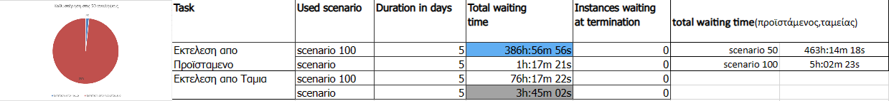
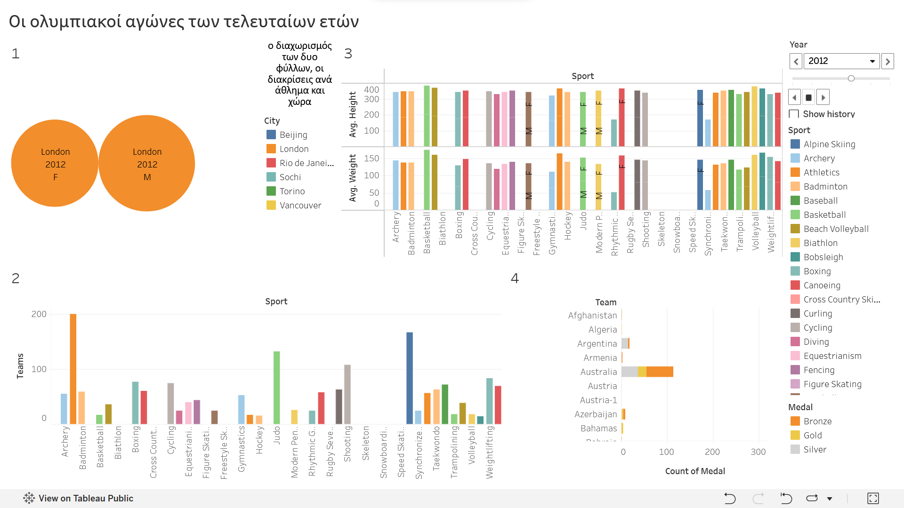
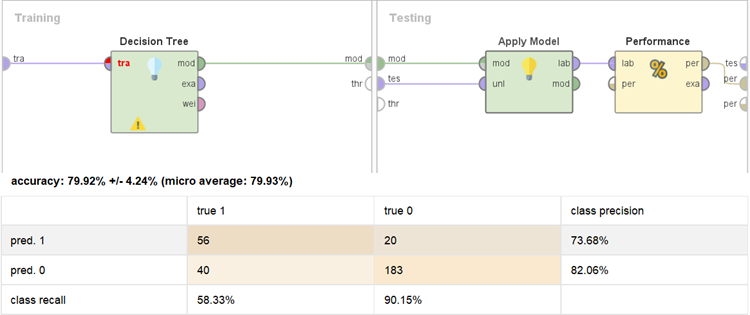
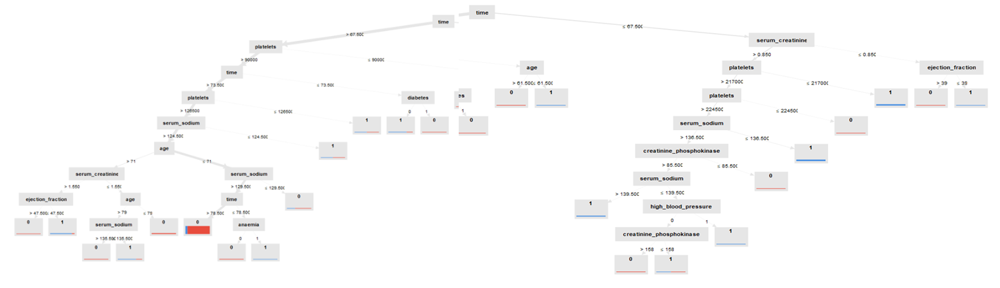

# Business Information Systems Project

A collaborative university project developed as part of the **Information Systems** course at the University of Macedonia.

The project combines enterprise technologies to model business processes, automate workflows, visualize data, and develop predictive analytics solutions.

> **Note:** This repository contains a team project completed by a five-member group.
---

## Technologies

- WordPress
- Signavio
- UiPath
- Tableau
- RapidMiner
- Jira / Kanban

---

## Project Components

- Business identity and company profile
- Corporate website development (WordPress)
- Business process simulation (Signavio)
- Workflow automation (UiPath)
- Interactive data visualization (Tableau)
- Predictive analytics using Decision Trees (RapidMiner)

---

## Screenshots

### Signavio Business Process

---

### Tableau Dashboard

---

### RapidMiner Workflow

---

### Decision Tree

---

## Interactive Tableau Dashboard

The Tableau dashboard created during the project is publicly available.

🔗 **Dashboard:**  
*[(Add your Tableau Public link here)](https://public.tableau.com/app/profile/.80892193/viz/olympics_16717972760580/Dashboard1)*

---

## My Contribution

My responsibilities included:

- Team coordination and collaboration
- Project documentation
- Final report writing and integration

---

## Learning Outcomes

Through this project I gained practical experience with:

- Business Process Modeling
- Workflow Automation
- Data Visualization
- Predictive Analytics
- Project Management
- Team Collaboration

---

## Documentation

The complete project report and the original assignment specification are included in the **docs/** folder.
