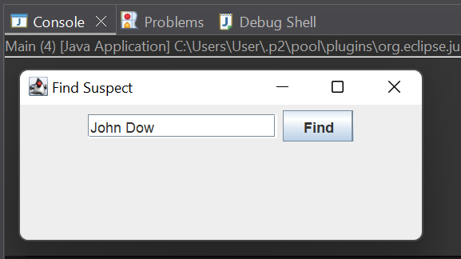
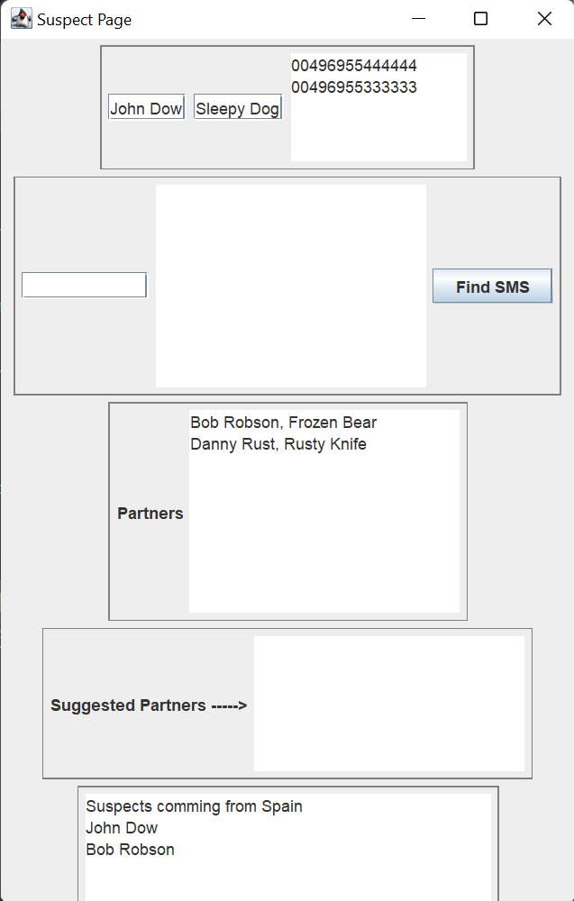
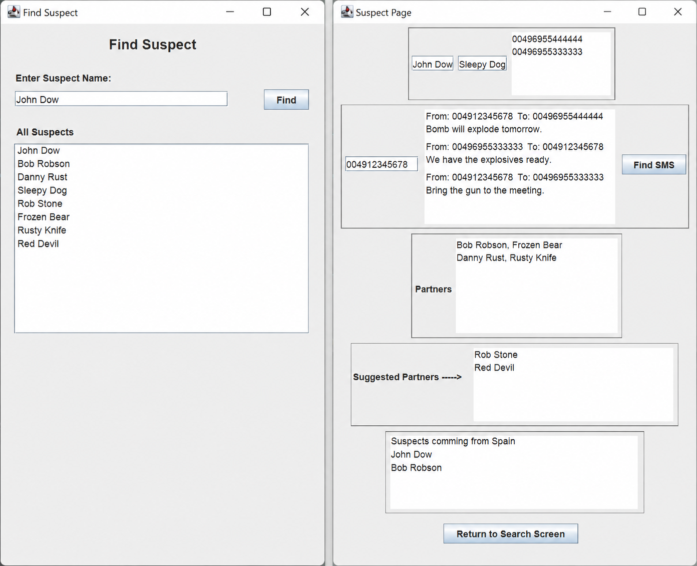

# SurveillanceNet v2

A Java desktop application developed as part of the **Object-Oriented Programming** course at the University of Macedonia.

This project extends the previous **SurveillanceNet** implementation by introducing a graphical user interface (Java Swing) and additional network analysis features for investigating suspect communications.

---

## Features

- Search suspects through a graphical interface
- Display suspect information and phone numbers
- Search suspicious SMS messages using keywords
- View direct communication partners
- Suggest potential collaborators based on mutual connections
- Display suspects sharing the same country of origin
- Navigate between search and suspect information screens

---

## Technologies

- Java
- Java Swing
- Object-Oriented Programming
- Java Collections Framework

---

## Project Structure

```
SurveillanceNet-v2/
│
├── src/        # Java source code
├── docs/       # Original assignment specification
├── images/     # Screenshots and class diagram
└── README.md
```

---

## Improvements over Version 1

- Added Java Swing graphical user interface
- Implemented suspect search window
- Added suspect information page
- Implemented suspicious SMS filtering
- Added suggested partner recommendation
- Added same-country suspect detection

---

## Screenshots

### Find Suspect Window



---

### Suspect Page Overview



---

### Application Workflow



---

## Learning Outcomes

Through this project I practiced:

- Object-Oriented Programming
- Java Swing GUI development
- Event-driven programming
- Class relationships and inheritance
- Collections and data management
- Desktop application development

---

## Assignment

The original university assignment specification is included in the **docs/** folder.
