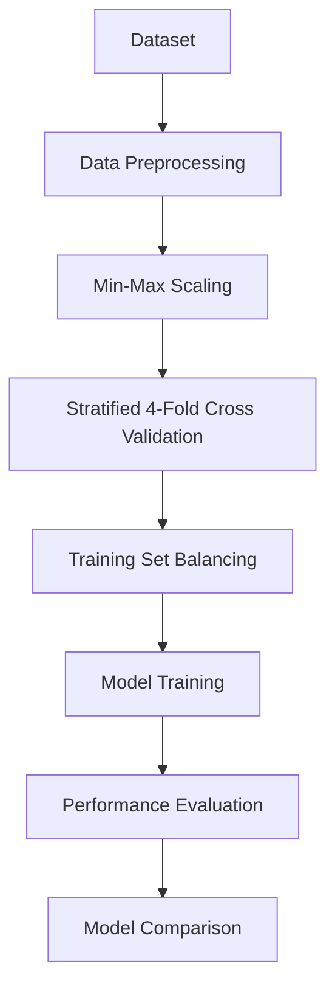
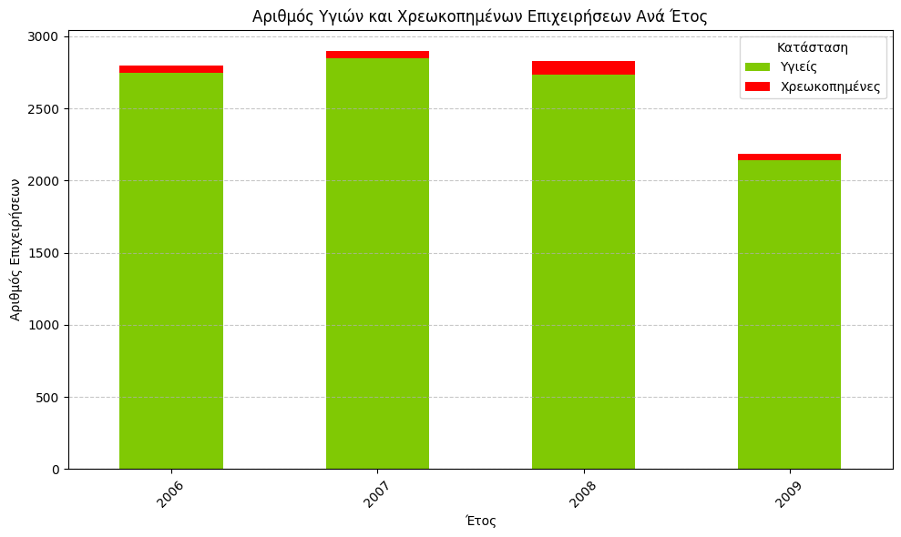
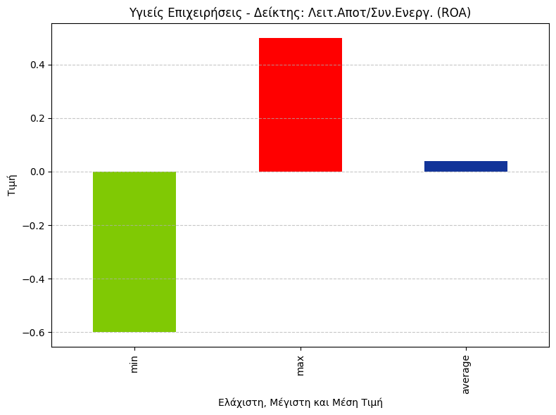
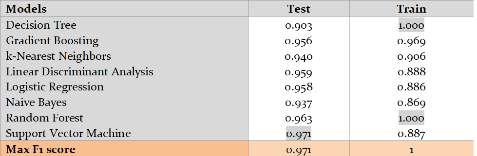
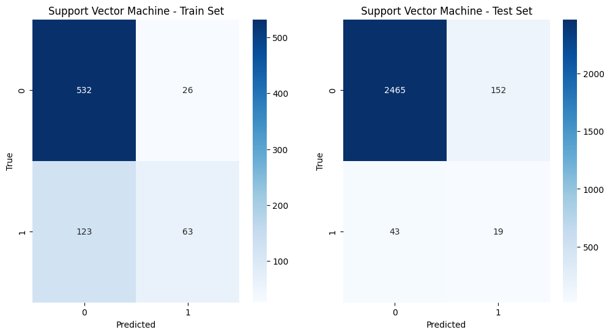

# Corporate Bankruptcy Prediction using Machine Learning

A machine learning project developed as part of the **Machine Learning** course at the **University of Macedonia**. This repository presents the implementation, experimental analysis, and report of a **3-member group project** focused on predicting corporate bankruptcy using financial indicators.

---

## Project Overview

The objective of this project was to design and evaluate a complete machine learning pipeline for classifying companies as healthy or bankrupt. Many classification algorithms were trained and compared using standardized evaluation metrics to determine the most effective model for the problem.

---

## Machine Learning Pipeline

The implemented workflow consists of:

* Data loading and preprocessing
* Missing value detection
* Min-Max feature normalization
* Stratified 4-Fold Cross Validation
* Training set balancing (3:1 healthy-to-bankrupt ratio)
* Model training
* Performance evaluation
* Comparative analysis of all classifiers

---

## Models Evaluated

* Linear Discriminant Analysis (LDA)
* Logistic Regression
* Decision Tree
* Random Forest
* k-Nearest Neighbors (kNN)
* Naïve Bayes
* Support Vector Machine (SVM)
* Gradient Boosting

---

## Evaluation Metrics

The models were evaluated using:

* Accuracy
* Precision
* Recall
* F1-Score
* ROC-AUC

---

## Technologies

* Python
* Pandas
* NumPy
* Google Colab

---

## Sample Results

### Distribution of Healthy and Bankrupt Companies

  

### Financial Feature Statistics

  

### Model Performance Comparison

  

### Confusion Matrix (Random Model)

  

---

## Documentation

The complete project documentation is available in the `report/` directory.
