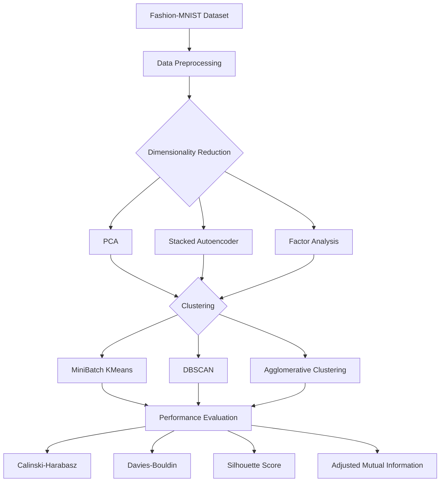
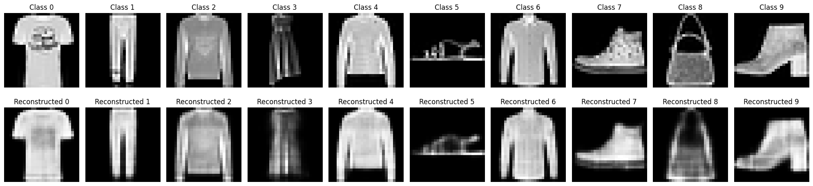
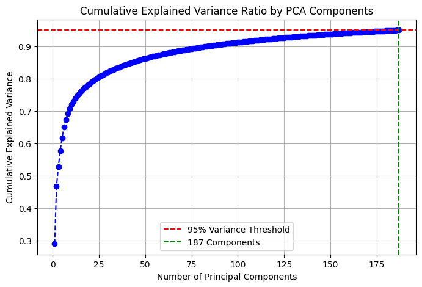
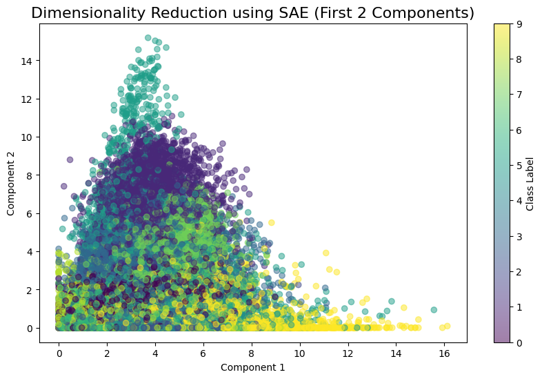
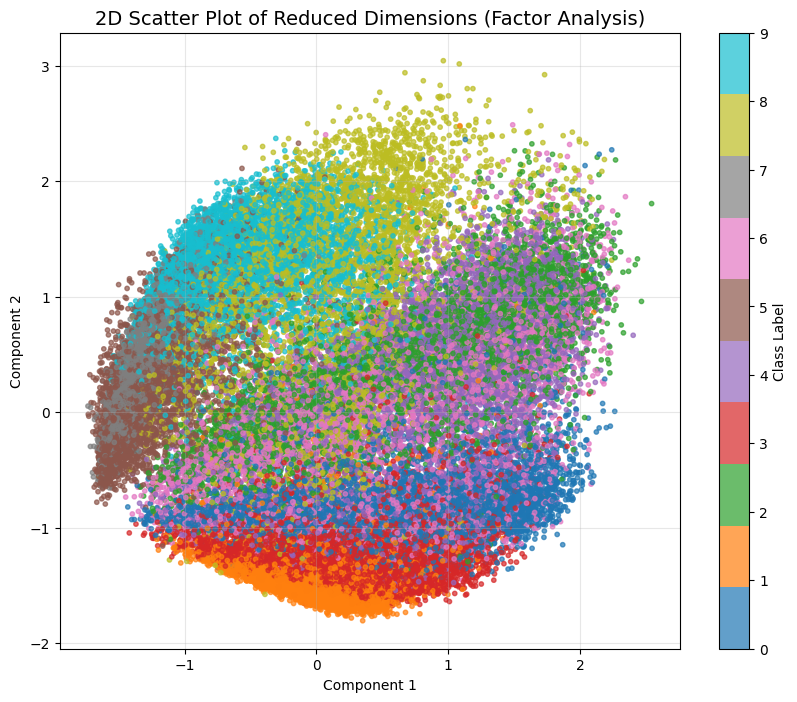
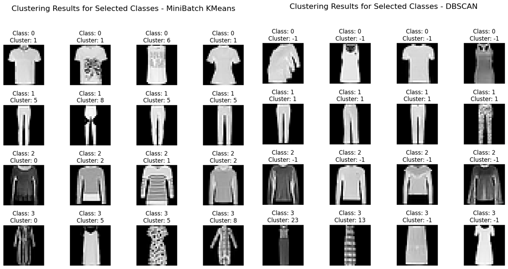

# Fashion-MNIST Clustering Comparison
### Dimensionality Reduction & Clustering Algorithms

<p align="center">
  
</p>


---

## Project Overview

This project investigates the impact of different **Dimensionality Reduction (DR)** techniques on the performance of clustering algorithms using the **Fashion-MNIST** dataset.

Three feature extraction methods are compared:

- Principal Component Analysis (PCA)
- Stacked Autoencoder (SAE)
- Factor Analysis (FA)

Each reduced representation is evaluated using three clustering algorithms:

- MiniBatch K-Means
- DBSCAN
- Agglomerative Clustering

Performance is assessed using four clustering evaluation metrics:

- Calinski–Harabasz Index
- Davies–Bouldin Index
- Silhouette Score
- Adjusted Mutual Information (AMI)

---

## Team

This was a group project developed as part of the **Machine Learning** course at the **University of Macedonia**.

---

# Dataset

**Fashion-MNIST**

- 70,000 grayscale images
- 10 clothing categories
- Image size: **28×28**
- High-dimensional image classification dataset commonly used for machine learning benchmarking.

---

# Technologies

- Python
- TensorFlow / Keras
- Scikit-Learn
- NumPy
- Pandas
- Matplotlib
- OpenPyXL

---

# Machine Learning Pipeline


---

# Project Results

## SAE Reconstruction

<p align="center">

</p>

---

## PCA Explained Variance

<p align="center">

</p>

---

## SAE Feature Space

<p align="center">

</p>

---

## Factor Analysis Feature Space

<p align="center">

</p>

---

## Clustering Examples

<p align="center">

</p>

---

## Overall Performance Comparison

<p align="center">

</p>

---

# Key Findings

- MiniBatch K-Means consistently achieved the strongest clustering performance.
- Stacked Autoencoder (SAE) produced the most informative latent representation.
- DBSCAN struggled on the Fashion-MNIST feature space regardless of the dimensionality reduction technique.
- Agglomerative Clustering delivered competitive performance but generally remained behind MiniBatch K-Means.
- No single combination dominated every evaluation metric, highlighting the importance of selecting algorithms according to the desired clustering objective.

---

# Future Improvements

- Hyperparameter optimization
- UMAP comparison
- t-SNE visualization
- HDBSCAN clustering
- CNN-based Autoencoder
- Interactive dashboards using Plotly
- Experiment tracking with MLflow

---

# Report

The complete technical report describing the methodology, experiments and analysis can be found in:

```
reports/MachineLearning_Report.pdf
```
